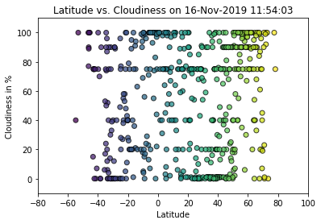
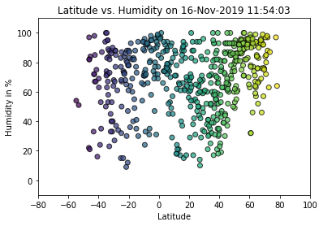
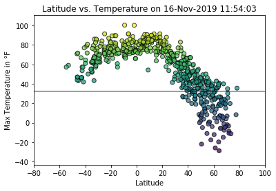
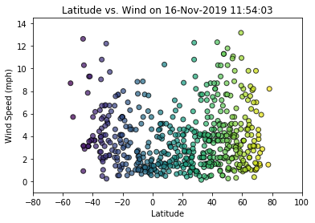

# Week 6 Python API Challenge
By A. Rijpkema on 11/16/2019

In the week 6 assignment 500 cities are randomly selected and subsequently used by the openweathermap.org’s API to retrieve weather information of that day per city. Temperatures, Windspeeds, Humidity and Rainfall are extracted and plotted against the city’s latitude in order to prove that temperatures are higher around the equator. A little formatting and the point was proven:

